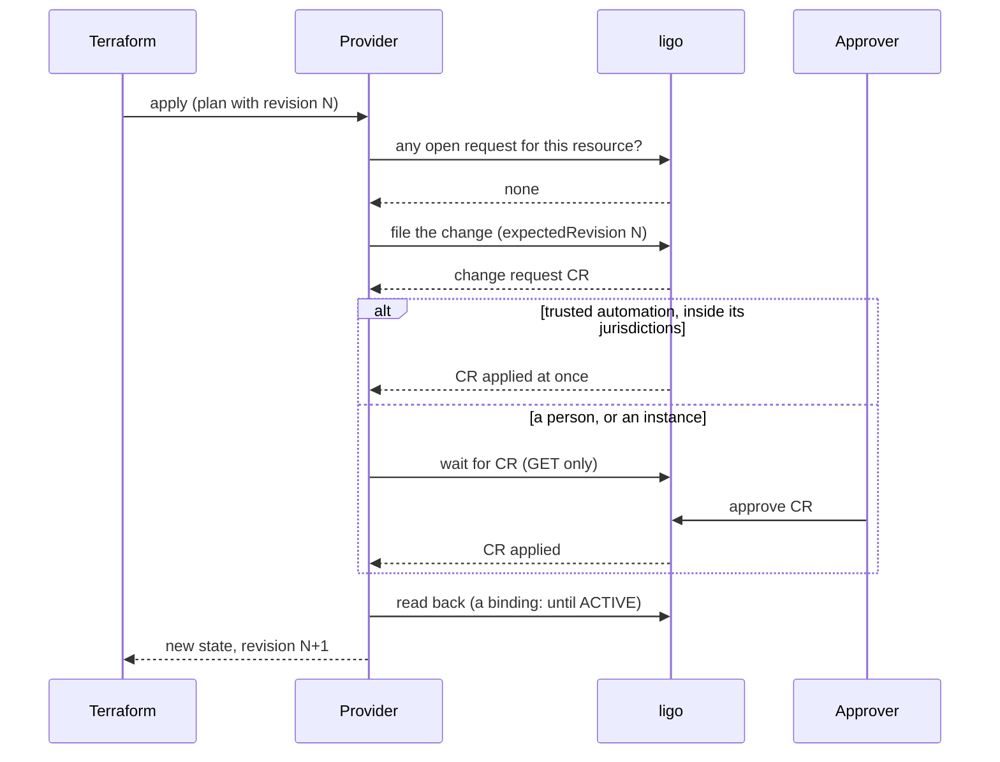

One write: file once, wait, record only what was applied.

```mermaid
sequenceDiagram
  participant TF as Terraform
  participant PR as Provider
  participant LG as ligo
  participant PE as Approver
  TF->>PR: apply (plan with revision N)
  PR->>LG: any open request for this resource?
  LG-->>PR: none
  PR->>LG: file the change (expectedRevision N)
  LG-->>PR: change request CR
  alt trusted automation, inside its jurisdictions
    LG-->>PR: CR applied at once
  else a person, or an instance
    PR->>LG: wait for CR (GET only)
    PE->>LG: approve CR
    LG-->>PR: CR applied
  end
  PR->>LG: read back (a binding: until ACTIVE)
  PR-->>TF: new state, revision N+1
```
