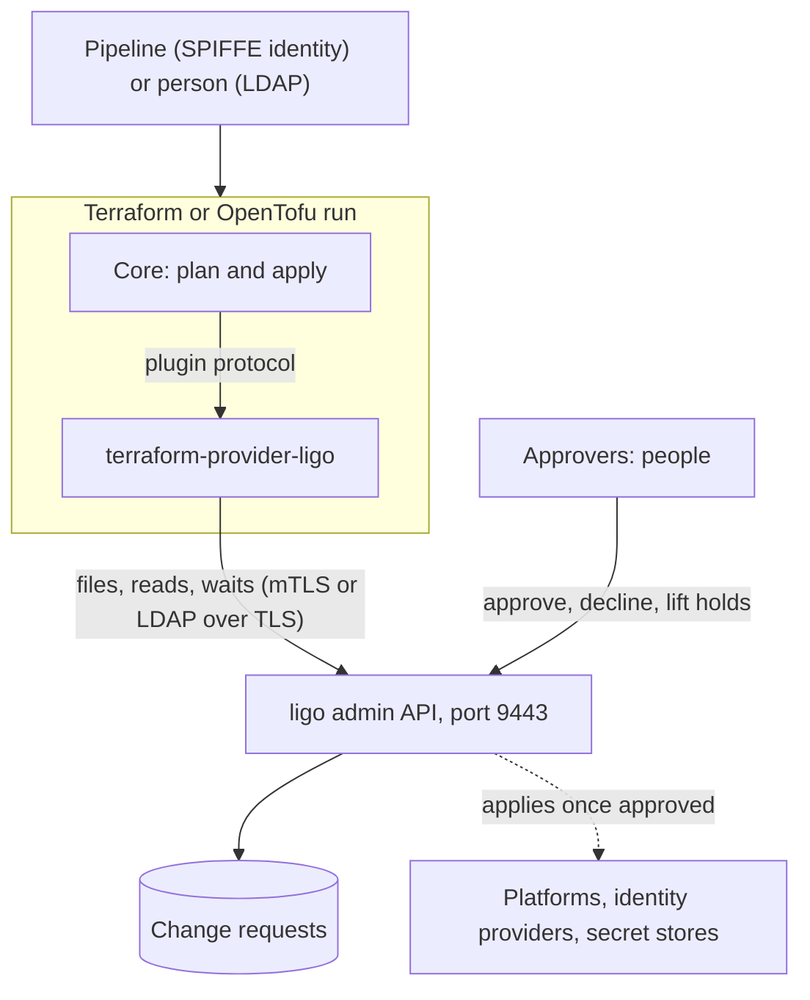

The provider in its surroundings.

```mermaid
flowchart TB
  U["Pipeline (SPIFFE identity) or person (LDAP)"]
  subgraph R["Terraform or OpenTofu run"]
    C["Core: plan and apply"]
    P["terraform-provider-ligo"]
    C -->|"plugin protocol"| P
  end
  L["ligo admin API, port 9443"]
  A["Approvers: people"]
  CR[("Change requests")]
  U --> R
  P -->|"files, reads, waits (mTLS or LDAP over TLS)"| L
  L --> CR
  A -->|"approve, decline, lift holds"| L
  L -.->|"applies once approved"| T["Platforms, identity providers, secret stores"]
```
