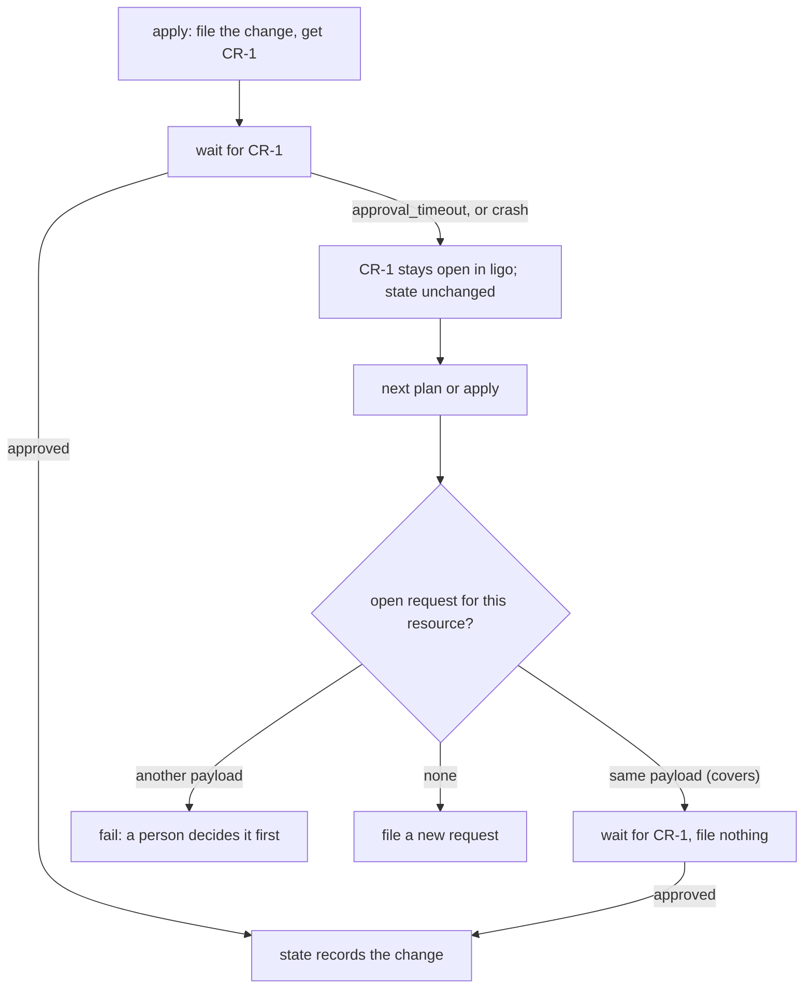

A run that ends while the request is still open does not file twice.

```mermaid
flowchart TB
  A["apply: file the change, get CR-1"] --> W["wait for CR-1"]
  W -->|"approved"| OK["state records the change"]
  W -->|"approval_timeout, or crash"| P["CR-1 stays open in ligo; state unchanged"]
  P --> N["next plan or apply"]
  N --> Q{"open request for this resource?"}
  Q -->|"same payload (covers)"| W2["wait for CR-1, file nothing"]
  Q -->|"another payload"| E["fail: a person decides it first"]
  Q -->|"none"| F["file a new request"]
  W2 -->|"approved"| OK
```
